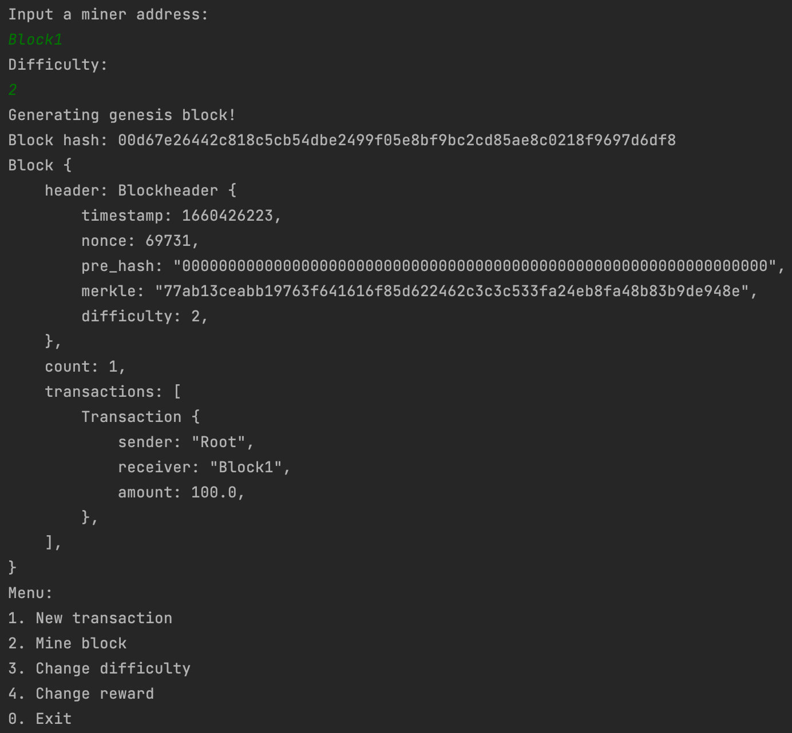

# Rust Blockchain Project

## Overview

This Rust Blockchain project is a simple implementation of a blockchain and a proof-of-work system. It allows users to create transactions and mine blocks, adjusting the difficulty and mining rewards as needed.



## How to Use

### Running the Application

1. **Start the Program**:
    - Run `main.rs` to start the program.
    - You will be prompted to enter a miner address and set the mining difficulty.

2. **Interacting with the Blockchain**:
    - The program provides a menu with options to create a new transaction, mine a block, change the difficulty, change the reward, or exit.

### Menu Options

1. **New Transaction**:
    - Enter sender and receiver addresses, and the transaction amount.

2. **Mine Block**:
    - Mine a new block with current transactions.

3. **Change Difficulty**:
    - Adjust the difficulty level for mining new blocks.

4. **Change Reward**:
    - Modify the reward given for mining a new block.

5. **Exit**:
    - Exit the program.

### Mining a Block

- When mining a block, the program automatically includes the reward transaction to the miner's address.
- The block, along with its transactions and nonce, is added to the chain after successful mining.

## Technical Details

- `main.rs`: Entry point of the application, handling user input and menu display.
- `blockchain.rs`: Contains the core blockchain logic, including:
    - `Transaction`: Represents a transaction in the blockchain.
    - `Blockheader`: Contains metadata for a block.
    - `Block`: Represents a block in the blockchain.
    - `Chain`: Manages the blockchain, including block creation and transaction handling.

## Features

- **Dynamic Difficulty**: Ability to change the difficulty of the proof-of-work algorithm.
- **Transaction Handling**: Create and manage transactions in the blockchain.
- **Mining Rewards**: Rewards are given for mining new blocks, with the option to change the reward amount.
- **Proof of Work**: Implements a basic proof-of-work algorithm to validate new blocks.
- **SHA-256 Hashing**: Uses SHA-256 for hashing blocks and transactions.

## Requirements

- Rust Programming Language
- External crates: `serde`, `serde_derive`, `time`, `sha2`

## Installation and Setup

1. **Clone the Repository**:
   ```bash
   git clone [repository-url]
   ```

2. **Navigate to the Project Directory**:
   ```bash
   cd [project-directory]
   ```

3. **Build and Run**:
   ```bash
   cargo run
   ```


